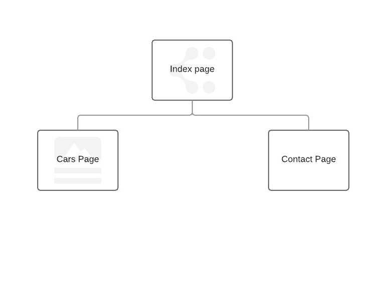

**Assignmet 2 Website**

**SiteMap**

The sitemap was relatively simple due to the website only having three pages. 

**Mobile Design**

In terms of mobile design i just wanted the website to get smaller alognside the smaller secreens of phones. The navigation at first was meant to be more traditional navigation bar. But during the process i chose to change this as i thought the newer "overlay" navigation would be much more better for both Desktop and mobile devices

**Key Features**
  
  * The navigation bar is one of the key features of the website. It's accessed by pressing the "open navigation" button and it slides onto the screen. This was achieved through the use of Javascript and CSS for the overlay. This navigation not only works for desktop but is designed to work with smaller devices as well such as mobile phones.
  * The slide show gallery on the homepage gives a welcoming look for users when they visit the website. This was achieved through the help of the code from w3cschools example code. The slideshow like the navigation needs a bit of everything, Javascript,CSS and HTML.
  * Google Maps Api allows for the map to have a marker and when the website gets smaller, the maps does and the marker doesn't move. 
  * Google fonts Api was used throughout as they give more variety, in the font department allowing for a better looking website.
  
  **Issues**
  
  * The main issue I came across was at the beginning stage of the website. When adding images they would not appear even though the code was fine. So I had to restart the website again and this time the images on the website started to appear
  * When putting the website through the W3c Validator, there were few errors where I hadn't closed some tags. But there when you use the "|" symbol it causes an error. To fix this I had to put the UTF character equivalent. This was achieved by typing "%7C"
  * The navigation bar I had at first, was more traditional and for mobile devices wouldn't have been the best. So I changed to a more "universal" navigation.
  * When using notepad++ it doesn't validate "@media" tags. So when using this for responsive work, it wouldn't work. So i had to change IDE's to get this to work for the website.
  
  ***Design Principles***
  
  * Proximity - Proximity is having whatevers on the page logically spread out or if the corresponding information is the same or connected then having such content close together, or in the same row.
  * Alignment - To have all the different areas of the content page aligned so they are together and look professional. Having content spread out and in random places it wil not be user friendly and the websit would be hard to use and see.
  * Repetition - The website needs to have consitency and repition in design and style. Every page needs a similar style as to give the website a consistent look for users.
  * Contrast - In a website you need to incorparate many different things. For users to be able to see the content of the website the colours used need to be such so that users can easily see the content. You can't have a dark colour on a black background as that would be hard to read and the opposite for a white background.    
  
  References:
  
  Tutorials: 
   
   * ***Slideshow gallery tutorial***: https://www.w3schools.com/howto/howto_js_slideshow.asp
   * ***Nav Tutorial***: https://www.youtube.com/watch?v=qLhBcHO3qtM
   * ***Google Maps***: https://developers.google.com/maps/documentation/javascript/adding-a-google-map#step_3_get_an_api_key
   
   Images:
   
   * Clio image: https://www.facebook.com/media/set/?set=a.197659683712121.60464.109568082521282&type=3
   * Micra image: http://www.swapz.co.uk/swapz/4696575/Nissan_Micra_K11_1_3_Conversion_Low_milage_Modified_/
   * Micra2 image: https://www.fastcar.co.uk/videos/nissan-micra-k12-on-air-ride/
   
   